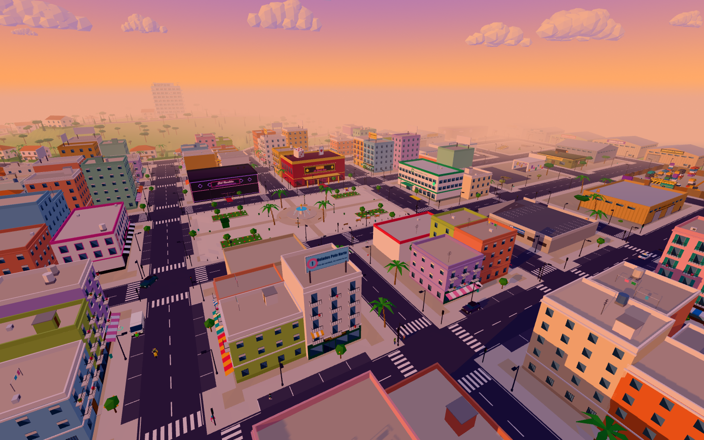
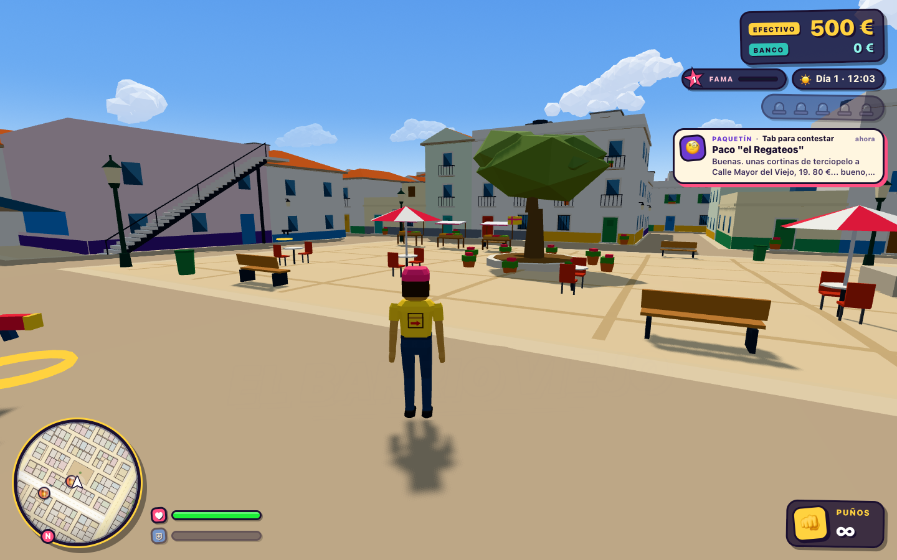
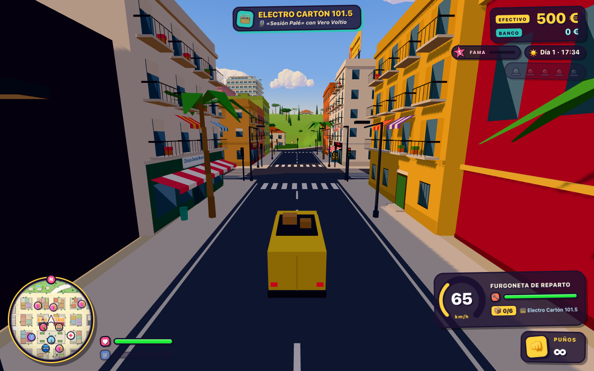
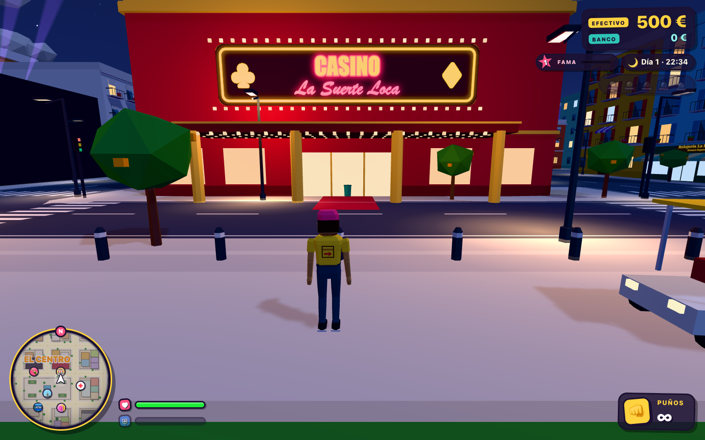
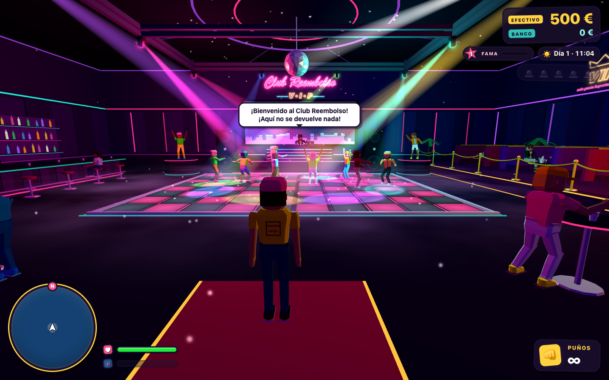
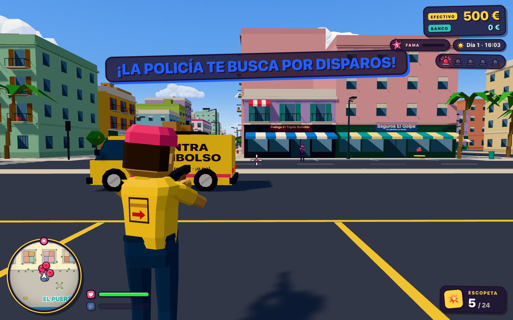
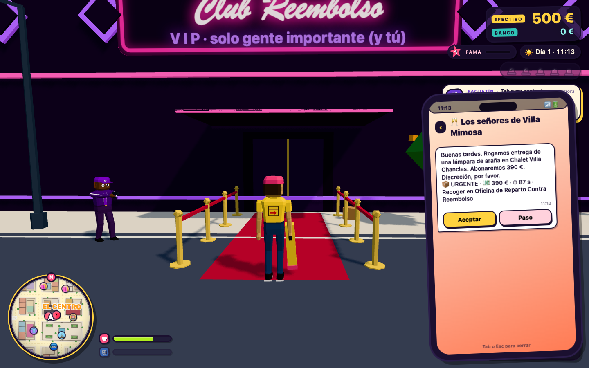

# CONTRA REEMBOLSO

**Juega aquí: https://agarroda-bit.github.io/contra-reembolso/**

Eres repartidor de paquetes contra reembolso en **Puerto Paquete**, una isla mediterránea pequeña, densa y caótica. Te llegan encargos al móvil, recoges paquetes, los llevas sin romperlos en furgoneta, moto o lo que robes por la calle, cobras en efectivo a clientes absurdos y te defiendes de **Los Devueltos**, la banda rival. Si la lías, viene la policía.

Juego 3D para navegador (Chrome o Safari, teclado y ratón). Todo está hecho por código: modelos, animaciones, sonido y música.



| | |
|---|---|
|  |  |
|  |  |
|  |  |

## Controles

| Tecla | Acción |
|---|---|
| WASD | Moverse / conducir |
| Ratón | Cámara (haz clic en el juego para capturarlo) |
| Shift | Correr / turbo |
| Espacio | Saltar / freno de mano |
| Clic izquierdo / derecho | Disparar / apuntar |
| F | Subir y bajar de vehículos, robar coches |
| E | Interactuar: entregar, cobrar, tiendas, puertas |
| R | Recargar |
| 1-5 y rueda | Cambiar de arma |
| Tab | Móvil (Enter acepta encargos) |
| M | Mapa grande |
| H | Claxon |
| Q / E en vehículo | Cambiar de emisora |
| Esc | Pausa |

## Para desarrolladores

```bash
npm install
npm run dev        # servidor local
npm run build      # comprobación de tipos + build
npm test           # pruebas con Playwright
npm run deploy     # publica en GitHub Pages (rama gh-pages)
```

- `?debug=1` muestra fps, teletransporte a los barrios y trucos.
- `?prueba=1` empieza a jugar sin menús (lo usan las pruebas).
- Estado del trabajo: `PROGRESO.md`. Decisiones: `DECISIONES.md`. Encargo original: `ENCARGO.md`.
